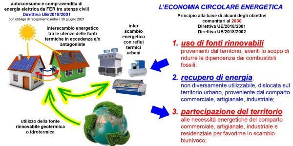

*Schema di economia energetica circolare con il teleriscaldamento a freddo (Cogeme)
da: 

1. Introduzione

1.1 definizione

1.2 configurazione di una rete di teleriscaldamento (“TLR”)

1.3 Cenni storici

1.4 Cenni storici sul TLR in Italia

1.5 Stadio di sviluppo del TLR in Europa

*(clicca sull'immagine per il .pdf in originale)*

----

