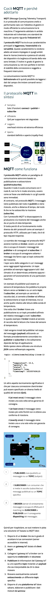

Letture:

 - :: <a href="https://Savelli-Teleriscaldamento.GitHub.io/study%20on%20efficient%20dhc%20systems%20in%20the%20eu%20-dec2016_final%20-%20public%20report6.pdf">Efficient district heating and cooling systems in the EU. Case studies analysis, replicable key success factors and potential policy implications

 - :: *Schema di economia energetica circolare con il teleriscaldamento a freddo (Cogeme)*
da: <a href="https://www.infobuildenergia.it/approfondimenti/teleriscaldamento-a-bassa-temperatura/?hcb=1">infobuildenergia.it</a>

----
Da :: INDAGINE CONOSCITIVA SUL SETTORE DEL TELERISCALDAMENTO,

1. Introduzione

1.1 definizione

1.2 configurazione di una rete di teleriscaldamento (“TLR”)

1.3 Cenni storici

1.4 Cenni storici sul TLR in Italia

1.5 Stadio di sviluppo del TLR in Europa

*(clicca sull'immagine per il .pdf in originale)*

----

Altre letture: 

 - :: <a href="https://www.camera.it/application/xmanager/projects/leg18/attachments/upload_file_doc_acquisiti/pdfs/000/004/811/Memoria_AIRU_Report_finale_.pdf"> Valutazione del potenziale di diffusione del teleriscaldamento efficiente sul territorio nazionale. Focus su sistemi di nuova generazione con fonti di calore di scarto e rinnovabile.</a>

 - :: <a href="https://www.gruppoiren.it/documents/21402/69847/TP_termoregolazione_DEF.pdf/23b9e880-4f63-407d-837c-43b7d3fa4522">Linee guida alla progettazione degli impianti di riscaldamento secondari serviti dalla rete di teleriscaldamento con particolare riferimento all’integrazione dei sistemi (impiantistici) esistenti con i sistemi di termoregolazione e contabilizzazione individuale del calore.</a>

----

