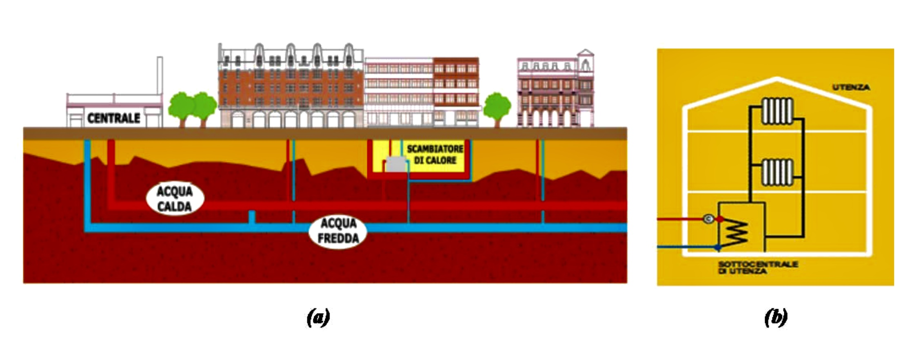

Ti è utile? <a href="mailto:savelli.teleriscaldamento@gmail.com">savelli.teleriscaldamento@gmail.com</a>.

------

 - #01 DIMENSIONAMENTO

Numero utenti e quantità significative:

Esempi in <a href="https://www.a2a.eu/it/citta2a-teleriscaldamento-a2a-piu-case-calde-sostenibili-infografica">Italia</a>, e in <a href="https://publications.jrc.ec.europa.eu/repository/bitstream/JRC104437/study%20on%20efficient%20dhc%20systems%20in%20the%20eu%20-dec2016_final%20-%20public%20report6.pdf">Europa</a>.

 - 01.1 DEFINIZIONE

1. Il Teleriscaldamento (“TLR”) è una soluzione alternativa per la produzione di acqua calda igienico-sanitaria e il riscaldamento degli edifici residenziali, terziari e commerciali, basata sulla produzione centralizzata di calore mediante una centrale termica, un impianto di cogenerazione16 o una sorgente geotermica e la sua trasmissione, mediante una rete di tubazioni in cui scorre un appropriato fluido di trasporto (vapore o, più comunemente, acqua calda o surriscaldata17), ad un insieme di utenti spazialmente concentrati (la rete di distribuzione locale del calore), ma distanti anche alcuni chilometri dalla fonte di produzione del calore.
La concentrazione degli utenti in un’area ben definita, come un quartiere, un’area commerciale o industriale, un insieme di utenze pubbliche prossime tra loro (prevalentemente scuole o impianti sportivi), o loro combinazioni, è necessaria per la sostenibilità economica del servizio: il collegamento di utenze isolate e sparse, lontane tra loro, è tecnicamente possibile ma comporterebbe costi proibitivi per l’utenza stessa. Non a caso, il termine inglese per teleriscaldamento - “district heating” - richiama proprio questa caratteristica di riscaldamento “distrettuale”.
2. Per teleriscaldamento, o riscaldamento urbano, si può quindi intendere un sistema a rete, realizzato prevalentemente su suolo pubblico, al servizio di un comparto urbano esistente o programmato, destinato alla fornitura di energia termica (nella duplice valenza di “caldo” e “freddo”), prodotta in una o più centrali, ad una pluralità di edifici appartenenti a soggetti diversi, ai fini di climatizzazione di ambienti e di produzione di acqua calda ad uso igienicosanitario, sulla base di contratti di somministrazione e tale da consentire, nei limiti di capacità del sistema, l’allacciamento alla rete di ogni potenziale cliente secondo principi di non discriminazione18.
3. Tali sistemi a rete, avendo dimensione prettamente locale, possono essere disegnati in modo da sfruttare le specifiche fonti di energia disponibili nel territorio su cui insiste la rete e in quello immediatamente circostante.
Lo sfruttamento di risorse energetiche locali può costituire un beneficio ambientale specifico permesso dall’adozione di sistemi di TLR.
16 Per “cogenerazione” si intende la produzione congiunta di elettricità e calore. La produzione di elettricità produce sempre calore; una centrale cogenerativa, tuttavia, è in grado di recuperare questo calore e fornirlo ai consumatori a fini di riscaldamento.
17 Per “acqua surriscaldata” si intende acqua ad una temperatura non inferiore a 120°, mantenuta ad una pressione tale da evitarne la vaporizzazione. L’uso dell’acqua surriscaldata è economicamente più vantaggioso di quello del vapore, consentendo un contenuto termico della rete diverse volte superiore a quello di una rete alimentata a vapore, a parità di investimento (cfr. Calza F. (a cura di), Manuale degli impianti termici e idrici, Tecniche Nuove, 2005, p. 5-44).
18 Il riferimento alla non discriminazione è contenuto nell’ art. 2, comma 3, lett. a) del decreto 24 ottobre 2005 (Direttive per la regolamentazione dell’emissione dei certificati verdi alle produzioni di energia di cui all’articolo 1, comma 71, della legge 23 agosto 2004, n. 239).
  

4. E’ controversa19 l’inclusione nelle reti di TLR urbano propriamente dette dei sistemi di produzione centralizzata e distribuzione di calore quali (i) la rete interna di stabilimento industriale destinata al trasporto di calore parzialmente o totalmente destinato alla climatizzazione degli edifici di esso facenti parte, (ii) una rete interna ad un complesso edilizio privato (supercondominio, complesso di edilizia popolare), (iii) una rete interna ad un complesso terziario-commerciale, (iv) una rete al servizio esclusivo di un complesso ospedaliero.
Alcune tipologie di tali sistemi centralizzati risultano storicamente incluse nelle rilevazioni dell’AIRU, perché avrebbero dovuto costituire i nuclei di reti di TLR vere e proprie, ma la maggior parte non lo sono.
5. La definizione normativa di TLR accolta ai fini della concessione degli incentivi all’energia da fonti rinnovabili invece sembra far riferimento ad un concetto molto ampio di TLR: “«teleriscaldamento» o «teleraffrescamento»: la distribuzione di energia termica in forma di vapore, acqua calda o liquidi refrigerati, da una o più fonti di produzione verso una pluralità di edifici o siti tramite una rete, per il riscaldamento o il raffreddamento di spazi, per processi di lavorazione e per la fornitura di acqua calda sanitaria” (art. 2, comma 1, lett. g), D. Lgs. 28/2011). In tale definizione possono rientrare anche i semplici sistemi di produzione centralizzata del calore.
6. In questa indagine, anche alla luce delle problematiche storicamente denunciate all’Autorità, si farà riferimento ad una definizione “ampia” di TLR, che includa, almeno in una certa misura, anche i “supercondomini” e agglomerati residenziali simili, nonostante le indubbie peculiarità che caratterizzano i sistemi di produzione centralizzata del calore di questo tipo rispetto al teleriscaldamento propriamente detto.
1.2: configurazione di una rete di teleriscaldamento (“TLR”)
7. In una rete di TLR il calore prodotto dagli impianti di generazione circola nella rete attraverso un fluido vettore (acqua calda o surriscaldata a temperature che dipendono dalle specifiche tecniche della rete, vapore). Il fluido vettore distribuisce il calore agli utenti mediante le tubature di “mandata”, e ritorna alla centrale, ormai raffreddato, attraverso le tubature di “ritorno”. Nella centrale il fluido è nuovamente riscaldato e il ciclo ricomincia.
La rete di TLR è quindi una rete chiusa, connessa all’impianto (o agli impianti) di generazione del calore attraverso una doppia rete di tubature.
8. Come evidenziato in Figura 1, le componenti principali di un sistema di teleriscaldamento sono: una centrale termica, ove viene prodotto il calore, una rete di trasporto e distribuzione, costituita da speciali condotte sotterranee, e un insieme di sottocentrali d’utenza, dove è posto uno scambiatore di calore.
19 Cfr. Bottio I., Caminiti N.M., Gangale F., Stefanoni M., Magnelli T., Teleriscaldamento e sistemi energetici integrati, ENEA, 2008.

</img>

 9. Normalmente la rete è alimentata da una centrale di generazione che fornisce il carico di base e può quindi funzionare in maniera efficiente, alla quale vengono affiancate una o più caldaie di integrazione e riserva – costituite sempre da impianti di sola generazione calore – destinate a coprire le punte o eventuali guasti alla centrale principale. Il dimensionamento e il numero delle centrali di generazione dipende, oltre che dalla domanda complessiva, dall’estensione della rete e dalla densità della domanda: reti più estese con domanda meno densa possono richiede più caldaie di integrazione, per far giungere la necessaria quantità di calore a tutti gli utenti.
10. Per generare calore può essere utilizzata una grande varietà di combustibili: gas naturale, biomasse, rifiuti solidi urbani, carbone, olio combustibile. Il calore può anche essere prodotto da terzi (p.es., impianti industriali) o da fonti naturali (p.es., fenomeni geotermici) e poi convogliato nella rete di distribuzione.
11. Gli impianti di generazione del vapore possono essere di due tipi: semplici - caldaie che producono esclusivamente calore, utilizzate solitamente solo nei primi anni di avviamento, quando l’utenza è in fase di acquisizione, mentre a regime sono usati come generatori di integrazione (per coprire i picchi di richiesta termica) o di riserva – o combinati – impianti costituiti da gruppi che
consentono la produzione contemporanea di energia elettrica e calore (cogenerazione).
Sempre più spesso la produzione di calore avviene in impianti di cogenerazione, nei quali viene sfruttato il calore prodotto dalla generazione di energia elettrica. Il teleriscaldamento basato su tali impianti riesce a raggiungere elevati livelli di efficienza nella trasformazione dei combustibili in energia.
 26

12. Tra le tecnologie a cogenerazione più utilizzate nel teleriscaldamento troviamo i motori a combustione interna20, i cicli a vapore21, turbine a gas22, cicli combinati23, microturbine24. La frontiera tecnologica è rappresentata dalle pompe di calore25 e dal solare termodinamico26.
13. La rete di distribuzione può essere distinta in due parti: la rete primaria o dorsale, che trasporta il fluido dalla centrale di generazione all’area dove si trovano le utenze ed è posata in suolo pubblico sotto la sede stradale, e la rete secondaria, costituita dalle tubazioni che conducono dalla dorsale alle utenze.
20 I motori a combustione interna comprendono i grandi motori diesel a gasolio o olio combustibile di tecnologia navale e i motori a ciclo Otto a gas naturale. Nelle applicazioni per teleriscaldamento si recupera il calore dai gas di scarico e dai processi di raffreddamento dell’olio e dell’acqua. I principali vantaggi offerti dai motori a combustione interna sono: - disponibilità per taglie a partire già da soli 15 kW;
- facile modularità;
- elevati rendimenti anche a carichi ridotti;
- elevata flessibilità rispetto alle variazioni di domanda di calore e di energia elettrica.
Necessitano però di manutenzione piuttosto complessa e le unità di taglia elevata possono presentare problemi di trasmissione delle vibrazioni.
21 Sistemi caldaia-turbina a vapore che possono operare a condensazione, a spillamento oppure a contropressione. Con questi sistemi il calore è prodotto prelevando dalla turbina una parte del vapore prima che abbia completato l'espansione, oppure utilizzando il vapore prodotto dal recupero del calore dei gas di scarico della turbina.
La turbina a spillamento consente una maggiore flessibilità operativa in funzione delle variazioni del carico elettrico e termico, mentre quella a contropressione ha una resa complessiva maggiore.
I principali vantaggi di questi sistemi sono:
- rendimenti elevati;
- possibilità di utilizzare combustibili meno pregiati;
- alta affidabilità di esercizio.
Gli aspetti più critici, invece, sono la mancanza di taglie disponibili per piccole installazioni e la limitata flessibilità rispetto alle variazioni di domanda di calore ed energia elettrica.
22 Sono tecnologie di derivazione aeronautica o industriale e presentano il vantaggio di rapida messa in produzione, ridotti costi di investimento e possibilità di esercizio completamente automatico. Nel teleriscaldamento si sfrutta l’elevata temperatura dei gas di scarico per la produzione di vapore o più raramente di acqua calda.
Presentano un basso rendimento elettrico e problemi di rumorosità, ma hanno l’enorme vantaggio di poter essere regolate, in fase di funzionamento, per inseguire le esigenze di carico, semplicemente agendo sulla quantità di gas immesso, esattamente come avviene per il motore di un aereo.
23 Questi sistemi abbinano le turbine a gas con il ciclo a vapore, cioè il gas di scarico dalla turbina fornisce calore ad una caldaia a recupero in cui si produce vapore ad alta pressione, utilizzato per azionare una turbina a vapore. Entrambe le turbine sono associate a generatori elettrici e si raggiungono rendimenti molto elevati. Per il teleriscaldamento si utilizza il calore refluo della turbina a vapore, riducendo però il rendimento elettrico.
Questo tipo di impianto oltre ad un alto rendimento consente anche una grande flessibilità operativa che permette di bilanciare la produzione termica o elettrica in base alle esigenze. I cicli combinati rappresentano oggi la tecnologia termoelettrica più avanzata a disposizione.
24 Sono sistemi costituiti da turbine a gas a singolo stadio per potenze elettriche da 30 a 100 kW. Sono sistemi adatti per la cogenerazione diffusa sul territorio, in alternativa ai piccoli motori a combustione interna. Presentano un buon rendimento rispetto alla taglia, bassi costi di manutenzione, flessibilità per quanto riguarda il combustibile utilizzabile (gas naturale, benzina, kerosene gasolio) e basse emissioni inquinanti.
25 I sistemi a pompa di calore possono alimentare reti di TLR. La pompa di calore è in grado di trasferire calore da un corpo a temperatura più bassa a uno a temperatura più alta, utilizzando il principio di funzionamento del frigorifero, capace di invertire il flusso naturale del calore che in natura, come noto, fluisce da un livello (temperatura) più alto a uno più basso. Ciò avviene utilizzando appositi compressori. La maggior parte delle applicazioni esistenti (p.es. Milano – Canavese) utilizza acqua di falda a circa 14° C. Possono essere alimentate anche da energia geotermica.
26 Si tratta di sistemi nei quali l’energia solare è utilizzata per riscaldare un fluido termoconvettore dotato di modesto calore specifico alla temperatura desiderata. Il fluido è poi utilizzato per trasportare il calore alle utenze.
 27

Nel caso di reti molto grandi, con centrali di generazione anche distanti dalla rete di distribuzione, è possibile distinguere anche una “rete di trasporto”, formata da grandi tubature, che trasportano il calore dalle centrali di generazione fino alla vera e propria rete primaria di distribuzione.
14. L’architettura di rete può essere varia: ad albero, ad anello, a maglie. La prima è utilizzata più spesso nelle reti più piccole, perché minimizza la lunghezza delle tubature, pur esponendo più utenze alle conseguenze di guasti nella rete; le altre due sono utilizzate in aree urbane estese e più densamente popolate.
15. Il sistema di distribuzione può essere diretto o indiretto.
Nel sistema diretto, un unico circuito idraulico collega la centrale di produzione
con le unità terminali, ossia i corpi scaldanti (termosifoni, radiatori, pannelli radianti, etc.) dell’utente.
Nel sistema indiretto – utilizzato nella maggior parte delle reti italiane - sono presenti due circuiti separati, in contatto tra loro attraverso uno scambiatore di calore collocato nei pressi dell’utenza. Giunta allo scambiatore, il fluido della rete trasferisce al fluido dell’impianto di distribuzione interna dell’edificio il calore necessario per riscaldare gli ambienti e per la produzione di acqua calda sanitaria.
16. Nel sistema indiretto, quindi, gli scambiatori di calore costituiscono l’interfaccia tra la rete di TLR e la rete interna all’edificio da riscaldare (condomìni con riscaldamento centralizzato o edifici unifamiliari). Essi costituiscono le “sottocentrali di utenza”, in corrispondenza delle quali viene installato un contatore (rappresentato dal simbolo © nella figura 1b) che serve a misurare la quantità di calore ceduta complessivamente all’utenza collegata allo specifico scambiatore di calore.
Nel caso in cui allo scambiatore siano allacciate più utenze, presso ciascuna di esse è installata una apposita apparecchiatura che consente di gestire autonomamente le temperature dei locali e di registrare i relativi consumi.
17. Il sistema indiretto, a fronte di maggiori costi di investimento, consente di utilizzare componenti a bassa pressione per l’impianto dell’utente, semplifica la manutenzione e l’individuazione delle perdite e rende più efficiente la regolazione e la contabilizzazione del calore. Esso è tipicamente utilizzato nelle reti maggiori dimensioni. Esso inoltre può semplificare l’allacciamento di edifici già esistenti e con un proprio sistema indipendente di generazione calore alla rete di TLR. In questi casi, infatti, l’impianto di distribuzione interno agli edifici allacciati alla rete resta inalterato e lo scambiatore di calore sostituisce la caldaia convenzionale.
18. Le tubazioni da cui è costituita la rete possono essere in acciaio, ghisa, vetroresina o materiale plastico, coibentate con lana di roccia o di vetro o schiuma di poliuretano espanso, ed esternamente sono protette con una guaina bituminata o con resine termoindurenti. Le più utilizzate ora sono le tubazioni pre-coibentate, specifiche per reti di teleriscaldamento, con un sistema integrato di localizzazione delle perdite.
28

19. Il TLR permette di realizzare alcuni benefici energetici e ambientali.
Sul piano dell’efficienza energetica, a parità di combustibile impiegato, esso permette di produrre calore mediante impianti con rendimenti più elevati e, soprattutto, permette di utilizzare il calore altrimenti disperso generato dalla produzione di energia elettrica.
Sul piano ambientale, a parità di calore prodotto, il TLR può consentire una significativa riduzione delle emissioni inquinanti e climalteranti, rispetto alla somma di quelle prodotte dalla combustione nelle caldaie individuali o condominiali sostituite.
Infine, il TLR fornisce un modo per impiegare il calore generato dall’incenerimento dei rifiuti, con evidenti benefici ambientali (minor ricorso allo smaltimento in discarica) ed energetici.
La dimensione dei benefici indicati cambia caso per caso e va paragonata ai costi di costruzione ed esercizio della rete di TLR.

